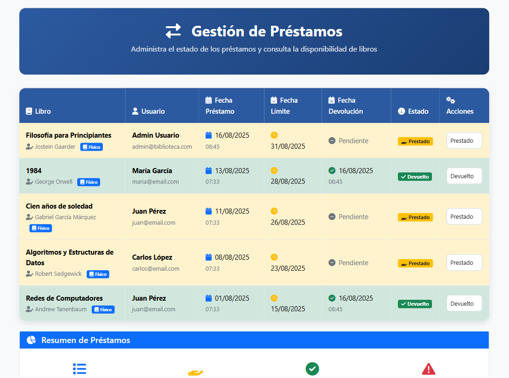
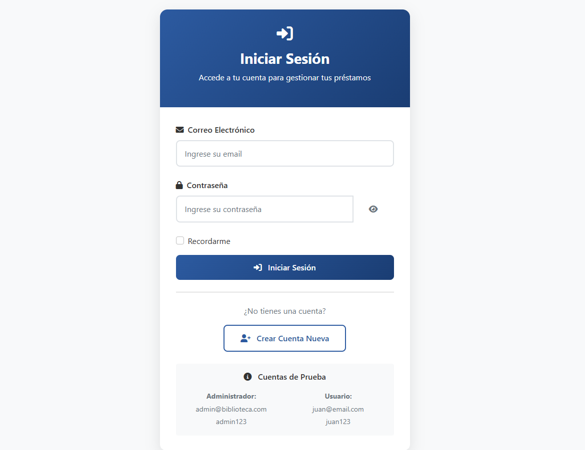

# Biblioteca Web - Sistema de Gestión Bibliotecaria

## 📋 Descripción del Proyecto

Sistema web para la gestión de una biblioteca con recursos virtuales y físicos, desarrollado en ASP.NET Core 8.0 con SQL Server.

## 🎯 Funcionalidades Principales

- **Form1 (Inicio)**: Pantalla de bienvenida con navegación principal
- **Form2 (Virtual)**: Biblioteca virtual con e-libros, bibliotecas públicas y recursos online
- **Form3 (Física)**: Catálogo de libros físicos por categorías (Literatura, Técnicos, General)
- **Form4 (Préstamos)**: Gestión completa de préstamos con actualización de estados
- **Form5 (Usuarios)**: Sistema de login, registro y gestión de usuarios

## 🔧 Requisitos Previos

- Visual Studio 2022 (o superior)
- .NET 8.0 SDK
- SQL Server 2019 (o superior) / SQL Server LocalDB
- SQL Server Management Studio (recomendado)

## 📁 Estructura del Proyecto

```
BibliotecaWeb/
├── Controllers/
│   ├── HomeController.cs
│   ├── BibliotecaController.cs
│   └── UsuarioController.cs
├── Models/
│   ├── Usuario.cs
│   ├── Libro.cs
│   ├── Categoria.cs
│   ├── Prestamo.cs
│   ├── LoginViewModel.cs
│   └── RegistroViewModel.cs
├── Views/
│   ├── Shared/
│   │   └── _Layout.cshtml
│   ├── Home/
│   │   └── Index.cshtml
│   ├── Biblioteca/
│   │   ├── Virtual.cshtml
│   │   ├── Fisica.cshtml
│   │   ├── Prestamos.cshtml
│   │   └── DetalleLibro.cshtml
│   └── Usuario/
│       ├── Login.cshtml
│       └── Registro.cshtml
├── Data/
│   └── BibliotecaDbContext.cs
├── Migrations/
│   ├── [timestamp]_InitialCreate.cs
│   ├── [timestamp]_InitialCreate.Designer.cs
│   └── BibliotecaDbContextModelSnapshot.cs
├── wwwroot/
│   ├── css/
│   │   └── site.css
│   ├── js/
│   │   └── site.js
│   └── images/
├── Scripts/
│   └── CreateDatabase.sql
├── Program.cs
├── appsettings.json
└── BibliotecaWeb.csproj
```

## 🚀 Instrucciones de Instalación

1. **Clonar/Descargar el proyecto:**
   ```bash
   git clone [URL_DEL_REPOSITORIO]
   cd BibliotecaWeb
   ```

2. **Restaurar paquetes NuGet:**
   ```bash
   dotnet restore
   ```

3. **Configurar la base de datos:**
   Abre la **Consola del Administrador de paquetes de NuGet** en Visual Studio y ejecuta el siguiente comando para crear la base de datos y sus tablas automáticamente:
   ```
   Update-Database
   ```

4. **Cargar datos de prueba:**
   Para llenar las tablas con datos de ejemplo, abre tu gestor de SQL (como SQL Server Management Studio), conéctate a la instancia **`(localdb)\mssqllocaldb`** y ejecuta el script `Scripts/CreateDatabase.sql`.

5. **Ejecutar la aplicación:**
   Presiona `F5` para iniciar el proyecto.

La aplicación estará disponible en:
- HTTPS: `https://localhost:7106`
- HTTP: `http://localhost:5216`

## 👥 Usuarios de Prueba

| Tipo | Email | Contraseña | Descripción |
|------|-------|------------|-------------|
| Administrador | admin@biblioteca.com | admin123 | Acceso completo al sistema |
| Usuario | juan@email.com | juan123 | Usuario regular |
| Usuario | maria@email.com | maria123 | Usuario regular |
| Usuario | carlos@email.com | carlos123 | Usuario regular |

## 📸 Capturas de la Interfaz





## 🎨 Características de Diseño

- **Responsive Design**: Compatible con dispositivos móviles y escritorio
- **Tema BiblioRed**: Colores y estilos inspirados en bibliotecas públicas
- **Iconografía**: Font Awesome 6.0 para iconos modernos
- **Animaciones**: Transiciones suaves y efectos de hover
- **UX/UI**: Interfaz intuitiva y fácil navegación

## 📊 Datos de Prueba Incluidos

- **Categorías**: Literatura, Técnicos, General
- **Libros Virtuales**: 7 recursos digitales
- **Libros Físicos**: 9 ejemplares con diferentes disponibilidades
- **Préstamos**: 4 préstamos de ejemplo con diferentes estados
- **Usuarios**: 4 usuarios de prueba

## 🔒 Funcionalidades de Seguridad

- Validación de formularios en cliente y servidor
- Sesiones para autenticación
- Protección CSRF integrada
- Validación de modelos con Data Annotations

## 🐛 Solución de Problemas Comunes

### Error de Conexión a Base de Datos
```
Verifica:
1. SQL Server está ejecutándose
2. La cadena de conexión es correcta
3. El usuario tiene permisos en la base de datos
```

### Error "Entity Framework Core is not installed"
```bash
dotnet add package Microsoft.EntityFrameworkCore.SqlServer
dotnet add package Microsoft.EntityFrameworkCore.Tools
```

### Error de Bootstrap/CSS
```
Verifica que los archivos estén en wwwroot/:
- lib/bootstrap/dist/css/bootstrap.min.css
- lib/bootstrap/dist/js/bootstrap.bundle.min.js
```

## 📈 Próximas Mejoras

- [ ] Implementar búsqueda avanzada
- [ ] Sistema de reservas
- [ ] Notificaciones por email
- [ ] API REST para móviles
- [ ] Reportes y estadísticas
- [ ] Sistema de multas
- [ ] Integración con códigos de barras

## 🤝 Contribuciones

Para contribuir al proyecto:

1. Fork el repositorio
2. Crea una rama para tu feature (`git checkout -b feature/nueva-funcionalidad`)
3. Commit tus cambios (`git commit -am 'Agregar nueva funcionalidad'`)
4. Push a la rama (`git push origin feature/nueva-funcionalidad`)
5. Crea un Pull Request

---

**Desarrollado por Daniel Mateus usando ASP.NET Core 8.0**
